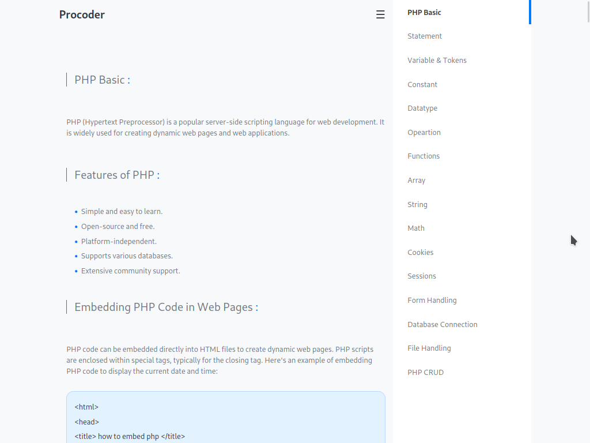

# Website-21

- **Name** : "PHPweb"

- **Description** : " Welcome to the "Website-21" repository! This is an educational website focused on learning PHP and related technologies. Here, you'll find resources, tutorials, and code samples to help you on your journey to mastering web development with PHP."

- **Version** : 0.0

- **Update** : 01-11-2023

- **Status** : RSET 

- **Responsive** : True

- **TechStack** : { HTML | CSS | JavaScript }

- **Thanks** : { VSCodium | Github | PHP }

- **Collobrate** : { Self }

- **Designed** | **Developed** : { Mayank }

- **CopyRight** : { Mayank }

- **URL** : https://mayankdevil.github.io/website-21/

- **Clone** :  https://github.com/MayankDevil/website-21.git

- **Download** : https://github.com/MayankDevil/website-21/archive/refs/heads/main.zip

## LOOK FEEL

## Responsive

_"this website has been designed to ensure a seamless and accessible user experience, making it easy for all visitors to read and navigate confortably."_

## Theme

_"this website employs a light theme with a predominantly blue color scheme, with occasional subtle touches of red for specific elements."_
